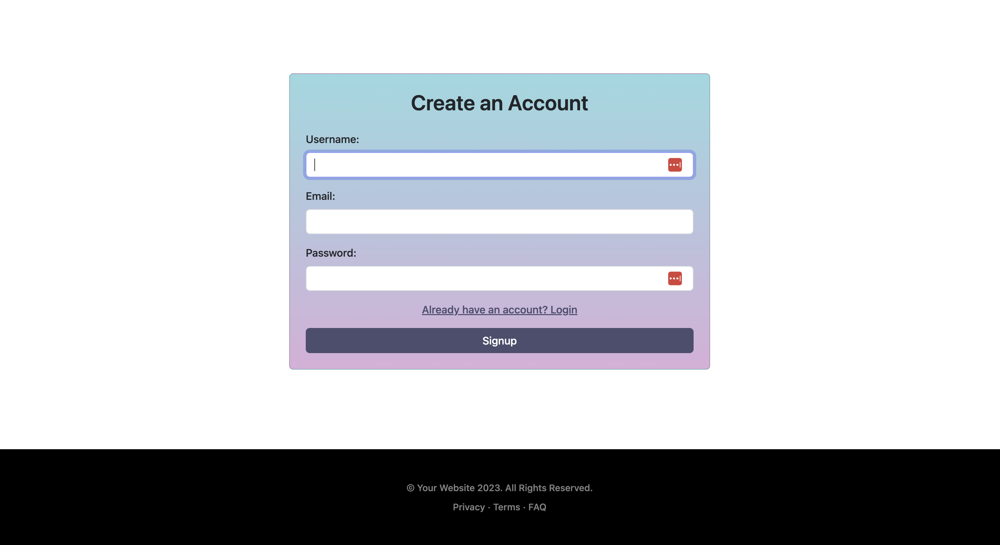
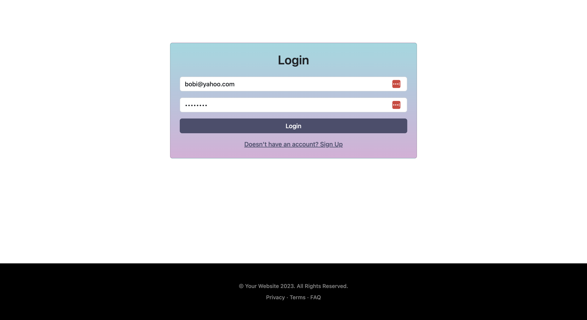
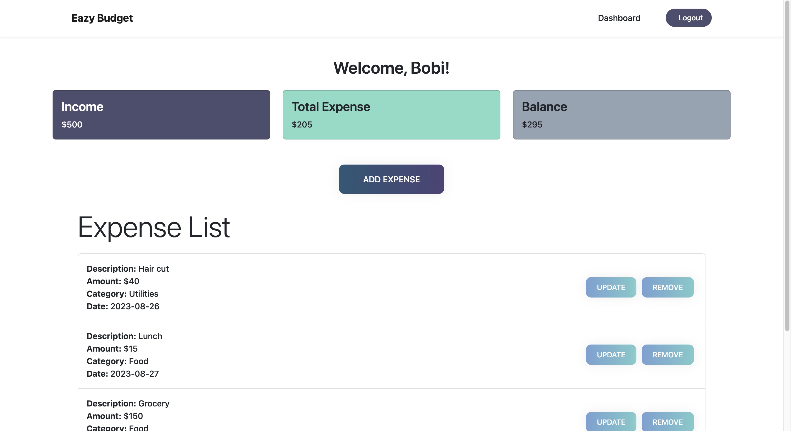
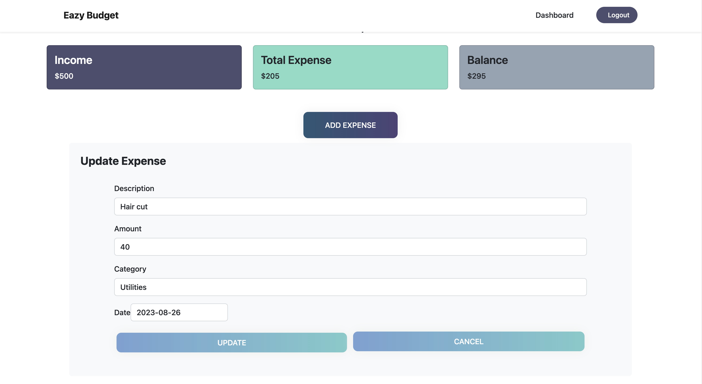
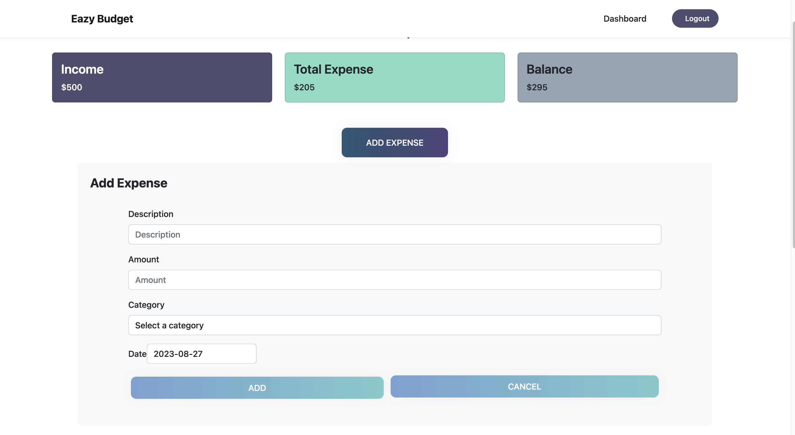

# MERN Stack Single-Page Application - Eazy Budget

Eazy Budget is a comprehensive budget tracker application designed for budget-conscious individuals who wish to efficiently track and manage their expenses. This application aims to provide users with better control over their financial activities, enabling them to make informed budgeting decisions. Visit the deployed application [here](https://morning-anchorage-93020-4e6c6fe3688a.herokuapp.com/)

## Table of Contents

- [Features](#features)
- [Technical Implementation](#technical-implementation)
- [Installation](#installation)
- [Usage](#usage)
- [Technologies Used](#technologies-used)
- [License](#license)
- [Contact](#contact)

## Features

- **User Registration**: New users can sign up for an account using their email and password.
    

    
    

- **User Authentication**: Existing users can log in using their credentials and are secured using JWT.
    

    
    

- **Dashboard**: Upon successful login, users are redirected to the main dashboard to view their expenses and budget details.
    

    
    

- **Expense Management**: Users can view, add, edit, and delete expenses, with each expense detailing its name, amount, and date.
    

    
    
    

    
- **Responsive UI**: The application's user interface is responsive and user-friendly, adapting to various screen sizes.
- **Security**: Sensitive API key information is stored securely, and user authentication is implemented using JSON Web Tokens (JWT).
- **Deployment**: The application is deployed on Heroku, accessible via a unique URL.

## Technical Implementation

1. React front-end with components for authentication, dashboard, expense list, and forms.
2. GraphQL server setup using Node.js and Express.js.
3. MongoDB database connection using Mongoose.
4. JWT-based user authentication.
5. Responsive UI components with CSS and potential UI library integration.
6. Input validation and error handling for login, signup, and expense forms.
7. Secure storage of sensitive API keys using server-side environment variables.
8. Code quality assurance through naming conventions, indentation, and comments.
9. Heroku deployment with environment variable and database configuration.
10. Comprehensive README documentation.

## Installation

1. Clone the repository
2. Navigate to the project directory: `cd eazy_budget`
3. Install server and client dependencies: `npm install`. This command will navigate into both the server and client directories and install the required dependencies for each part of the application.

## Usage

1. Once you have the project installed, you can start the development environment by running the following command: `npm run develop`. This command utilizes the concurrently package to run both the server and client concurrently. The server will automatically restart when changes are made, and the client development server will be available at `http://localhost:3000`.
2. To build the production-ready client bundle, you can use the following command: `npm run build`. This will generate an optimized build of the React app in the client/build directory.
3. Finally, you can start the application in production mode by running: `npm start`.
Note: Before running the application in production, make sure to set up the appropriate environment variables and configurations as needed for your deployment environment.

## Technologies Used

- **React**: Front-end framework for building user interfaces.
- **GraphQL**: Query language for APIs.
- **Node.js**: JavaScript runtime for server-side logic.
- **Express.js**: Web application framework for Node.js.
- **MongoDB**: NoSQL database for data storage.
- **Mongoose**: Object Data Modeling (ODM) library for MongoDB and Node.js.
- **JSON Web Tokens (JWT)**: For user authentication and data security.
- **Bootstrap**: Frontend styling and layout

## License

Please refer to the LICENSE in the repo.

## Contact

- **Name**: Retno Damayanti
- **Email**: <mayahere5@gmail.com>
- **GitHub**: [GitHub Profile](https://github.com/retnodamayanti)